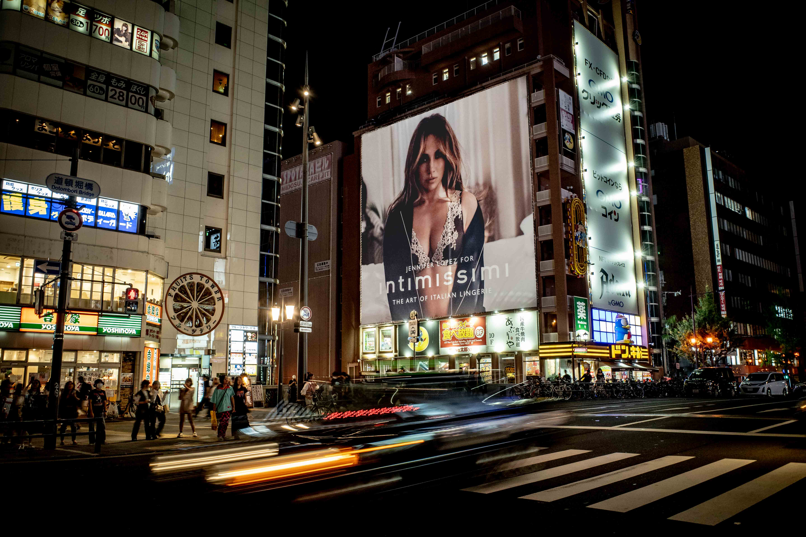

Title: Osaka Japan, Futurism and Street Photography
Date: 2023-10-18
Author: George Lindley

This is a different type of street photography that I normally do. But it came naturally, as did my exploration of motion in my photos. There’s a few photos where motion come out very well, it’s not overdone, because it’s purely using a Ricoh GR (wide angle) hand held camera. Keeping the shutter speed low (1/8) i.e. 0.125 of a second the lens stays open to capture shot - and the car has moved in that amount of time, but my steady hand can stabelize the shot for full clarity in that amount of time. Most use a tripod, but you don’t have the time or the care for any bit of fiddly equipment, anything that takes you away from the moment.

Of course this is edited, there’s no magic or secret lurking there. I’ve brought up the blacks and the exposure in the Jennifer Lopez advert to bring out the capitalism. In fact I learnt how close to the forefront of society sex, lusty dreams, other-worldly images and words, are, in a land of the only act of atomic lunacy. 

You have no idea the lunatic ideas that come out when you let your mind wander. I like the French word for ‘fun’, it’s divirtirse - meaning to distract yourself (and not necessarily with others). It’s not distraction without creativity, and without incredible economic progress, the fact the three can go together is mindblowing, and has to be experienced only by coming to Japan.

I highly recommend the book ‘Reinventing Japan’, where you get an insight to post-war Japan through the decades marked by Japanese inventions. Why Japan needed these inventions, and judging by the export success of nintendo & mario, pokemon, hello kitty, hentai (don’t google it) and karaoke. 

And the distractions are numerous, and say more about who you are than how you behave in actual society. In actual society you are disciplined in all areas, clean, responsible from 5 years old and above all, functional. But outside of work you are in another world, it’s the most real world-like example of the Netflix show ‘succession’ where the inside of work you has complete memory loss of the outdoor you. What that show misses out on is the art of how energies in Japan completely flow from one world to another, like a wonderful and colorful diffiusion of culture. The out-of-the-screen fashion styles, the heavenly food, and the poignant story-telling style of manga. Did you know Van Gogh was inspired by the post-impressionist movement that came out of Japan? I invite you to see a wonderful museum in Kurakishima, Okhama, where post-lining the galleries is a surprisingly expansive and valuable impressionist set of paintings west meets east, and the eastern paintings date back before the western of the time. There too is Monet’s waterlillies, both in the painting and gifted from his French Provincial garden to the museum’s wonderful gardens.

Back to the picutre of J-Lo to put it crassly. Osaka’s streets at night have the modern New York crass, emphasized in this photo by the taxi lights. This is not the modern Japan, this is the futuristic Japan. And here lies the difference between modern and contermporary, that of future and advanced. The former words in the pairs (modern and future) are specific periods in the past (1910-1940 for modern, and 1980-1990 - the boom of Japan’s economy for futuristic). The latter are status of time (now - contemporary) and status of technologicy and society (dare we go there) - advanced. 

Modern and futuristic Japan.